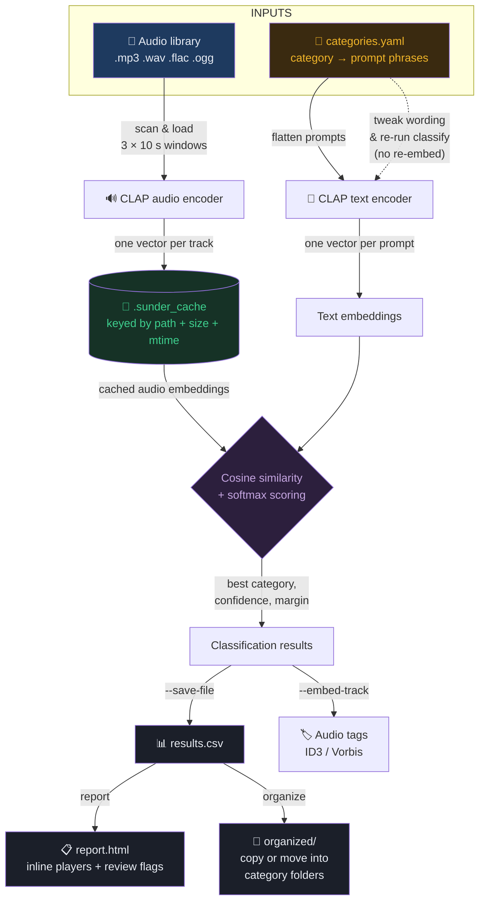

# Sunder — Ambience track categorizer

Local CLI that sorts a large library of AI-generated ambience tracks into **your** categories using zero-shot [CLAP](https://huggingface.co/laion/larger_clap_music) (audio–text matching). No training and no cloud API: embeddings are computed once, cached on disk, then classification is cheap to re-run when you tweak category wording.

See [CHANGELOG.md](CHANGELOG.md) for release notes.

## How it works



**Key insight:** embedding is the slow step (GPU: minutes, CPU: hours) but only runs once per track. Classifying is a cheap matrix multiply — tweak `categories.yaml` and re-run `classify` as many times as you like without re-embedding.

## Setup (Windows)

From the repo root (Python 3.9+; this repo’s venv was created with `py -3.9`):

```powershell
py -3.9 -m venv .venv
.\.venv\Scripts\python -m pip install --upgrade pip
.\.venv\Scripts\pip install -r requirements.txt
```

If you have an NVIDIA GPU, install a CUDA build of PyTorch **before** `requirements.txt`, for example:

```powershell
.\.venv\Scripts\pip install torch torchvision torchaudio --index-url https://download.pytorch.org/whl/cu124
```

The first `embed` / `classify` run downloads `laion/larger_clap_music` from Hugging Face (about 1 GB) into the local Hugging Face cache.

## Desktop app

Double-click **`Sunder.exe`** in the repo folder, or from a terminal:

```powershell
.\.venv\Scripts\python -m sunder app
```

Build (or rebuild) the exe with:

```powershell
powershell -ExecutionPolicy Bypass -File packaging\build_exe.ps1
```

That produces a small launcher at `Sunder.exe` and `dist\Sunder.exe`. It starts this repo’s `.venv` — keep the exe next to `.venv`. A fully portable CUDA bundle (`packaging\build_exe.ps1 -Standalone`) copies PyTorch into `dist\Sunder\` and needs on the order of 15 GB free disk; the launcher is the usual path.

Use `--browser` if you want the UI in your default browser instead (also the fallback when `pywebview` is not installed):

```powershell
.\.venv\Scripts\python -m sunder app --browser
```

| Control | Same as |
|---|---|
| Library · Embed / Scan / Report / Full analysis | `sunder embed`, scan, `sunder report`, or embed → classify → report |
| Review | accept / reject / custom category + comment (`A` / `R`); in-app player; open `report.html` |
| Settings · Organize | `sunder organize` (copy by default; move asks you to type `MOVE`). Stamp tags with the Settings checkbox; Full analysis classifies. |

Jobs run on a background thread so the window stays responsive. Cancel writes any embeddings already finished.

## 1. Edit categories

Open [`categories.yaml`](categories.yaml). It is pre-filled with the D&D ambience taxonomy from [`suno/prompts/`](suno/prompts/). Edit names and phrasings freely — more descriptions usually improve matching:

```yaml
forest:
  - green woodland forest ambience
  - harp wooden flute and fingerpicked guitar
boss:
  - dark orchestral boss fight music
  - menacing low brass taiko and string ostinato
```

## 2. Embed (slow, once)

```powershell
.\.venv\Scripts\python -m sunder embed "D:\path\to\tracks"
.\.venv\Scripts\python -m sunder embed suno\downloads
```

Useful flags:

| Flag | Meaning |
|---|---|
| `--cache DIR` | Cache directory (default `.sunder_cache`) |
| `--limit N` | Only the first N files (smoke-test a sample) |
| `--force` | Re-embed even if a file is already cached |
| `--recursive` / `--no-recursive` | Walk every nested folder (default: on) |
| `--device cuda` | Force GPU / `cpu` / `mps` |

`embed` walks the whole tree under the path you give it — for example `suno\downloads` picks up `Playlists\<name>\*.mp3` and `Liked Songs\*.mp3` at any depth. Hidden folders and tooling dirs (`.git`, `.venv`, `.sunder_cache`) are skipped. Use `--no-recursive` to stay in the top folder only.

Each track is represented by three ~10 s windows (start / middle / end), averaged. Cached embeddings are keyed by path + size + mtime, so unchanged files are skipped on later runs.

## 3. Classify (fast to iterate)

```powershell
.\.venv\Scripts\python -m sunder classify --save-file
.\.venv\Scripts\python -m sunder classify --embed-track
.\.venv\Scripts\python -m sunder classify --save-file --embed-track
```

Pass one or both flags (`--save-file` writes `results.csv`; `--embed-track` stamps genre/SUNDER_* tags into each audio file). Audio samples are not re-encoded.

- MP3/WAV: ID3 `TCON` (genre), plus `TXXX` frames `SUNDER_CATEGORY`, `SUNDER_CONFIDENCE`, `SUNDER_PROMPT`
- FLAC/OGG: Vorbis `genre` / `sunder_category` / `sunder_confidence` / `sunder_prompt`

`report` and `organize` read the CSV, so include `--save-file` if you want those next. To tag files from an existing CSV without re-classifying:

```powershell
.\.venv\Scripts\python -m sunder tag
```

| Flag | Meaning |
|---|---|
| `--categories FILE` | YAML taxonomy (default `categories.yaml`) |
| `--out FILE` | CSV path when using `--save-file` (default `results.csv`) |
| `--save-file` | Write the CSV |
| `--embed-track` | Write tags into audio files |
| `--threshold 0.35` | Softmax below this is marked low-confidence |
| `--min-margin 0.02` | Small cosine gap vs runner-up is also flagged |

## 4. Review

```powershell
.\.venv\Scripts\python -m sunder report
```

In the desktop app, open **Review** to work the queue: listen, accept the suggestion, type your own category, or reject. Accepted and rejected tracks stay out of **To review** until you open **Reviewed**. Re-classify keeps those decisions.

`sunder report` writes `report.html` (it does not open a browser). Tracks are grouped by category, with inline players, review flags, and a **Needs review** section for low-confidence files.

## 5. Organize files

Safe default **copies** into `organized/<category>/`:

```powershell
.\.venv\Scripts\python -m sunder organize
.\.venv\Scripts\python -m sunder organize --dest "D:\sorted" --mode copy
```

`--mode move` relocates the originals. Copy is recommended until you have spot-checked the report.

## Supported audio

Recursive scan of `.mp3`, `.wav`, `.flac`, `.ogg` under the folder you pass to `embed`, including all subfolders. WAV/FLAC/OGG are read with `soundfile`; MP3 uses `miniaudio` (no ffmpeg install).

## Typical workflow for thousands of tracks

0. `python -m sunder app` and run **Full analysis** from Library, or:
1. `embed --limit 20` on a sample, `classify --save-file`, open the report, tweak prompt wording.
2. `embed` the full library (GPU: minutes; CPU: on the order of 1–2 hours).
3. `classify --save-file --embed-track` → `report` → adjust YAML → `classify --save-file` again.
4. `organize --mode copy`, then delete or replace the source tree when you are satisfied.
